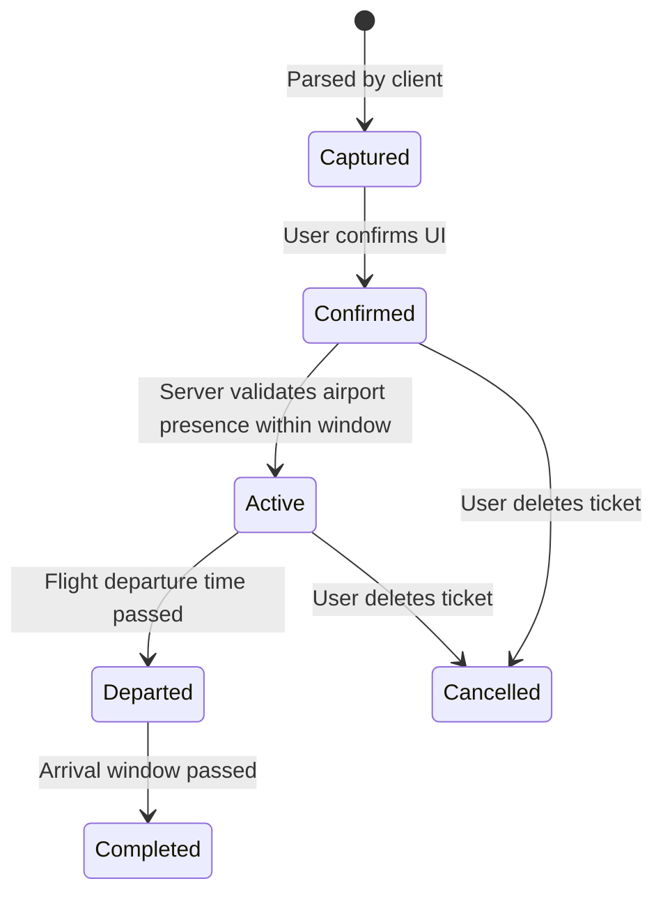

# Architectural Implementation Plan: Boarding Pass & Flight Intelligence Pipeline

> **Location:** `gate-closes-app-v2/docs/BOARDING_PASS_INTELLIGENCE_PLAN.md`
> **Target Systems:** `gate-closes-app-v2` (Flutter Client) & `gate-closes-api` (Backend Authority)
> **Status:** In Progress — ⏸ PAUSED mid STEP 16a, see "TURNING-BACK POINT" in §6 Phase E before resuming. Phases A, B, E mostly built; Phase B′ ✅ complete (STEP 10a–10d all done); Phases C, D, F incomplete
> **Last verified against working tree:** 2026-09-25. Flutter side: `flutter test` 74/74 green, `flutter analyze` 0 errors (unchanged since STEP 10d — not touched this session). Backend: `tsc --noEmit` clean; 27 controller/service specs confirmed green as of STEP 10c, but that run predates the STEP 16a index/service edits below, which are written and type-check but have NOT been confirmed to pass via a real test run — see the turning-back point for why.

---

## 0. Current State (read this before picking up work)

Verified by running the suites and reading the tree — not by reading this document's history.

| Area | State |
|---|---|
| Parser engine (BCBP / OCR / manual / confidence / normalizer) | **Built** |
| Airport registry (`airports.json`, 1.1 MB bundled, `LocalAirportRegistry`) | **Built and now initialized at runtime — B-1 fixed (STEP 10a)** |
| Coordinator wired into scanner sheet | **Built** |
| Adaptive confidence banner (3 tiers) | **Built** (banner only; no 1-tap path — see B-4) |
| Client entity/model/repo/controller carry `boardingDateTime`, `terminal`, `gate`, `seat`, `idempotencyKey` | **Built** |
| One-way flights (`returnDateTime` optional, client + server) | **Built** |
| Backend Joi schema, Mongo model, idempotency + duplicate lookup | **Create + update schemas built and now test-covered for their field contracts; idempotency/duplicate-detection *logic* still untested and unindexed — see B-3, B-7** |
| Camera capture (barcode scan / on-device OCR) | **Built (STEP 12a)** — live barcode scan, plus photo/screenshot → barcode-in-image → OCR via a pluggable `TicketExtractionPipeline`. Not yet device-tested. |
| SQLite offline store + sync queue | **Not started** |
| Server lifecycle state machine + active window | **Not started** |
| Legacy parser stack removal | **✅ Done (STEP 10d)** |

### Blocking defects (fix before anything in Phase C/D)

**B-1 — ✅ FIXED (STEP 10a).** The airport registry was empty at runtime, silently disabling the whole feature.
`LocalAirportRegistry.initialize()` is now awaited in `bootstrap.dart` before `runApp`, so it completes before any boarding-pass screen can mount. `initialize()` is idempotent (`if (_isInitialized) return;`), so this is safe even if something else primes the registry first.

Regression coverage: `test/features/airport/data/datasources/local_airport_registry_initialize_test.dart` calls `LocalAirportRegistry.instance.initialize()` directly — the real production path loading the bundled asset via `rootBundle` — and asserts known IATA codes (`MNL`, `SFO`, `LHR`) resolve. This is distinct from `boarding_pass_pipeline_test.dart`, which only ever primes the registry via `loadFromJsonString(...)` and would stay green even if the production init path were broken again; that gap is why this defect shipped unnoticed the first time.

**B-2 — ✅ FIXED (STEP 10b).** `idempotencyKey` was plumbed end-to-end but never generated.
`uuid` is now a direct dependency (`pubspec.yaml`). `BoardingPassScannerSheet` generates one `Uuid().v4()` per **sheet instance** (a `final` field, not regenerated per submit call), so retrying a failed submission from the same open sheet reuses the same key, while reopening the sheet for a genuinely new attempt gets a new one — that's the semantic idempotency requires. It flows through `saveFlightTicket` → `createFlightTicket` → the POST payload unchanged.

Regression coverage: `test/features/flight/data/repositories/flight_repository_impl_test.dart` asserts the repository forwards `idempotencyKey` verbatim in the POST body when provided, and omits the key entirely when not — locking in the wire contract independent of the UI layer.

Still open: nothing yet *persists* the key across process restarts (that's STEP 13/14 — the sync queue is where a key must survive an app kill mid-retry, not just a widget rebuild). And B-3 (no unique index) means the server-side half of this guarantee still isn't enforced.

**B-3 — `unique(userId, idempotencyKey)` does not exist.**
§4.2 calls this a "Backend Invariant." `database.indexes.ts` has no `flightTicket` entry. The actual protection is a read-then-write at `flight.ticket.service.ts:104`, which races under concurrent retries — exactly the scenario idempotency exists to handle. Needs a partial unique index plus E11000 handling.

**B-4 — "1-tap confirmation" is not implemented.**
DoD item 3 promises a 1-tap confirmation modal for high-confidence parses. High confidence currently renders an emerald banner over the same form, and `_handleSubmit` runs identical validation for all three tiers. Either build the 1-tap path or amend the DoD.

**B-5 — ✅ FIXED: invariant kept, fields dropped.** `passengerName`, `pnr` and `rawContent` were removed from `ParsedFlight`; the BCBP parser no longer reads positions 2–29 and the sheet no longer shows a passenger line. Regression test: `ticket_fixture_capture_test.dart` ("Core Invariant 5"). The only raw-content path left is the debug-only fixture capture tool (below), which redacts before copying and does not exist in release builds.

~~**B-5 — The PII invariant is now actively violated in the UI.**~~ (original finding)
Invariant 5 states passenger legal name, PNR, and barcode payloads are discarded immediately. `BcbpParserService` populates `passengerName`, `pnr`, and `rawContent`; `OcrParserService` populates `rawContent`; and `boarding_pass_scanner_sheet.dart:446-449` now renders `Passenger: {passengerName}` on screen. This moved away from the invariant, not toward it. **Decide explicitly: drop the invariant, or drop the fields.** Do not leave the document asserting a privacy property the code does not have.

**B-6 — ✅ FIXED (STEP 10c).** The edit path silently dropped the new fields.
This turned out to be a **full-stack** gap, not just a client one — worth flagging because the original wording implied a client-only fix. `FlightRepository.updateFlightTicket` had no `gate`/`seat`/`terminal`/`boardingDateTime` params (now added, both interface and impl), **and** the backend's `PUT /flight-ticket` Joi schema in `flight.ticket.controller.ts` had no entries for those fields either — with `stripUnknown: true`, it would have silently deleted them from the request even after the client started sending them. Both sides fixed together; fixing only the client would have shipped a change that still did nothing.

Regression coverage: `flight_repository_impl_test.dart` (Flutter) asserts the PUT payload carries the four fields when provided and omits them when not. `flight.ticket.controller.spec.ts` (new — first controller-level test for this route, following the existing `airport.controller.spec.ts` pattern of calling the handler directly with req/res doubles rather than booting supertest) asserts the Joi-validated value reaching `FlightTicketSvc.update` actually contains them, and that a partial edit (e.g. `{ seat: '22C' }` alone) still validates.

**B-7 — The new backend logic has zero test coverage.**
`flight.ticket.spec.ts` passes 3/3, but all three cover arrival-time estimation. Neither the idempotency lookup nor the duplicate-flight branch added in `flight.ticket.service.ts` is exercised. "All backend tests passing" is true and does not mean the new code works.

**B-8 — ✅ FIXED (STEP 10d), with one correction to the original diagnosis.**
The premise — "two parallel parser stacks are live at once" — turned out to be half right. Before touching anything, every file in the legacy stack was traced for importers across `lib/` and `test/`: `BoardingPassController`, `boardingPassControllerProvider`, `BoardingPassRepository`/`Impl`, `BoardingPassEntity`, and the legacy `domain/parsers/bcbp_parser.dart` / `domain/heuristics/boarding_pass_ocr_heuristics.dart` had **zero importers outside their own small cluster** — no route, no page, no provider anywhere else in the app referenced `boardingPassControllerProvider`. `ProfilePage` and `AddBoardingPassPage` were already fully on the new stack (`flightControllerProvider`, `BoardingPassCoordinator`). So this wasn't "two live stacks needing reconciliation" — it was one live stack and one **entirely dead** one that happened to still compile. Deleted outright:
- `presentation/controllers/boarding_pass_controller.dart`
- `data/repositories/boarding_pass_repository_impl.dart`
- `domain/repositories/boarding_pass_repository.dart`
- `domain/entities/boarding_pass_entity.dart`
- `domain/parsers/bcbp_parser.dart`
- `domain/heuristics/boarding_pass_ocr_heuristics.dart`
- their two dedicated test files

Coverage preserved rather than dropped: the legacy tests' two edge cases not yet covered by the new stack (invalid Julian day, blank seat field) were ported into `boarding_pass_pipeline_test.dart` against `BcbpParserService` — with one documented **behavior difference** called out in the test comment, not silently inherited: the legacy parser rejected the whole record (`null`) on an out-of-range Julian day; the new engine instead keeps the record and leaves `departureDateTime` null (confidence scores accordingly), so an otherwise-decodable flight number/route isn't discarded over one bad field.

**Correction to the original diagnosis — `airport_entity.dart` ↔ `airport_reference.dart` is *not* a duplicate pair and was deliberately left alone.** `AirportEntity` (`features/airport/domain/entities/airport_entity.dart`) is a server-backed geofence/detection model — `icao`, `distanceKm`, `insideBoundary`, `detectionState`, sourced from `AirportRepository`'s live backend calls (nearby search, inside-boundary checks) — and is load-bearing across `WorldMapController`, `AirportPickerSheet`, `AirportSearchPage`, and now the scanner sheet's UI state. `AirportReference` is a lightweight offline value object (`city`, `timezone`, `airportType`) sourced from the bundled `airports.json`, used only by the parser engine for IATA validation with zero network dependency — that offline-only property is Core Invariant #1. Collapsing them would either give the offline parser a live-backend dependency it's explicitly designed not to need, or strip geofence fields from the live detection model. Left as two distinct domain concepts that happen to share the word "airport."

---

## 1. System Vision & Architecture Principles

The Boarding Pass & Flight Intelligence Pipeline upgrades Gate Closes from a basic OCR ticket prefill into a resilient, offline-capable parsing engine.

```mermaid
graph TD
    subgraph Client ["Flutter Native Client (gate-closes-app-v2)"]
        RawInput["Camera Barcode / Camera OCR / Manual Entry"] --> IngestionEngine["Boarding Pass Ingestion Layer"]
        IngestionEngine --> RawPass["Raw Barcode String / OCR Text Blocks"]
        RawPass --> Parser["BoardingPassParser Coordinator"]

        subgraph ParserEngine ["Specialized Parsers & Registry Domain Service"]
            Parser --> BCBP["BcbpParser (IATA Res 792)"]
            Parser --> OCR["OcrParser (Scored Contextual Regex)"]
            Parser --> Manual["ManualFlightParser"]

            BCBP --> AirportService["AirportCodeValidator Domain Service"]
            OCR --> AirportService
            Manual --> AirportService

            AirportService --> LocalRegistry[("Bundled Airport Registry\nassets/data/airports.json")]
        end

        AirportService --> Confidence["ConfidenceEngine (Confidence vs Completeness)"]
        Confidence --> Candidate["Candidate ParsedFlight"]
        Candidate --> AdaptiveUI["Adaptive Confirmation UI\n(High: 1-Tap | Med: Review | Low: Edit)"]
        AdaptiveUI --> SQLiteStore[("Local SQLite Store\nFlightTicket & Idempotent SyncQueue")]
    end

    subgraph Backend ["gate-closes-api (Authoritative Core)"]
        SQLiteStore -->|POST /api/flight-ticket (with Idempotency-Key)| ApiController["FlightTicketController"]
        ApiController --> ValidationService["Airport & Ticket Validation Service"]
        ValidationService --> CanonicalDB[("Authoritative MongoDB\nairport & flightTicket")]
        ValidationService --> LifecycleService["Server-Authoritative Lifecycle Engine"]
        LifecycleService --> AffinityEngine["Affinity Engine (PS, DT, BT)"]
        AffinityEngine --> MatchingRooms["Conversation Channels & Echo Overlays"]
    end
```

### Core Architecture Invariants:
1. **Client Parses, Server Governs**: The client extracts flight candidates locally with zero network dependency; the backend validates IATA codes, departure dates, and establishes the authoritative ticket lifecycle.
2. **Confidence $\neq$ Completeness**: A flight can be extracted with 100% confidence while missing optional schedule details (e.g. departure time). Confidence and completeness are modeled independently.
3. **Structured Storage Isolation**:
   * `flutter_secure_storage`: Exclusively holds credentials, access tokens, and refresh tokens.
   * `SQLite` (via `sqflite`): Manages structured flight tickets, pending offline sync queues, and parser metadata.
4. **Idempotent Sync Queue**: All ticket submissions include a client-generated `idempotencyKey` to guarantee safe retries across intermittent connectivity.
5. **On-Device Privacy**: No raw boarding pass image is uploaded to cloud OCR services.
   > ⚠️ **Contested — see B-5.** The original wording also required PII (passenger legal name, PNR, barcode payloads) to be discarded immediately after routing extraction. The code does the opposite: it retains `passengerName`, `pnr`, and `rawContent` on `ParsedFlight` and now displays the passenger name. This clause is suspended until STEP 26 resolves it one way or the other.

---

## 2. Refined Domain Models & Contracts

### 2.1 Confidence vs. Completeness
* **Location:** `gate-closes-app-v2/lib/features/boarding_pass/domain/entities/` — **built**
* `parse_confidence.dart` — `ParseConfidence` with per-field scores plus `overall`, and `isHigh` (≥ 0.85) / `isMedium` (0.50–0.84) / `isLow` (< 0.50) accessors driving the adaptive UI.
* `parsed_flight.dart` — `ParsedFlight` with `hasRequiredRoute` and `hasDepartureSchedule`. Also carries `passengerName`, `pnr`, `rawContent` (see B-5).

### 2.2 Airport Registry Domain Service
* **Location:** `gate-closes-app-v2/lib/features/airport/domain/` — **built**
* `entities/airport_reference.dart` — `AirportReference { iata, name, city, countryCode, timezone, latitude, longitude, airportType }`
* `services/airport_code_validator.dart` — `AirportCodeValidator { isValidIata, resolveAirport }`
* `data/datasources/local_airport_registry.dart` — singleton implementation over the bundled asset. **Loads only when `initialize()` or `loadFromJsonString()` is called; neither happens in production (B-1).**

---

## 3. Specialized Parser Subsystem Architecture

Actual tree as built. The legacy stack (`bcbp_parser.dart`, `boarding_pass_ocr_heuristics.dart`, `boarding_pass_entity.dart`, `boarding_pass_repository*.dart`, `boarding_pass_controller.dart`) was removed in STEP 10d — see B-8:

```
lib/features/boarding_pass/
├── domain/
│   ├── entities/         parsed_flight.dart · parse_confidence.dart
│   ├── enums/            boarding_pass_source.dart
│   └── services/         boarding_pass_coordinator.dart · confidence_engine.dart · flight_normalizer.dart
├── data/
│   └── parsers/          bcbp_parser_service.dart · ocr_parser_service.dart · manual_flight_parser.dart
└── presentation/
    ├── pages/            add_boarding_pass_page.dart
    └── widgets/          boarding_pass_scanner_sheet.dart

# Note: no domain/repositories, no data/repositories, no presentation/controllers
# under boarding_pass/ anymore — ticket persistence goes through
# features/flight/{domain,data,presentation}, not a separate boarding-pass
# repository. That split (parse locally -> hand the result to FlightController)
# is intentional, not a gap.
```

### 3.1 BCBP Parser Rules (IATA Res 792)
* **Never assume checksum = 1.0 confidence.**
  > ⚠️ `ConfidenceEngine` currently hard-codes `overall = 0.98` for any fully-decoded BCBP regardless of per-field scores. That is the same shortcut at a different constant. Addressed by STEP 24.
* **Julian Date Rollover**: implemented — `FlightNormalizer.resolveJulianYear` uses a ±180-day sliding window against `DateTime.now()`.
* **Minimum record length**: the parser accepts `length >= 47`, but a mandatory IATA M1 record is 60 characters. A truncated 47-char string decodes into a plausible-looking flight. Addressed by STEP 24.
* **Timezone derivation is not implemented.** `FlightNormalizer.combineDateAndTime` accepts an `AirportReference? airport` and ignores it, always returning `DateTime.utc(...)`. `departureTimezone` is stored as a string while the `DateTime` is built as though wall-clock time were UTC. There is no `timezone` package in `pubspec.yaml`, so the conversion is currently impossible. Addressed by STEP 25.

### 3.2 OCR Parser & Proximity Scoring
* **Keyword & Layout Proximity** (implemented): origin scored against `FROM`/`ORIGIN`/`DEP`, destination against `TO`/`DEST`/`ARR`.
* **Unbounded fallback (risk).** When keyword matching fails, `ocr_parser_service.dart:64-81` picks `candidates[0]` as origin and `candidates[1]` as destination *by document order*. Any stray valid 3-letter token becomes a route, filtered only by a 22-word stopword list against a registry of thousands of codes. This is the highest-risk path in the feature and needs the accuracy bar in STEP 21, not just fixtures.
* **No Live Route Assumption**: the local parser does not assume a specific flight flies a specific pair; it only verifies both codes resolve in the registry.

---

## 4. Local Persistence & Idempotent Sync Queue

**Status: not started.** `pubspec.yaml` has no `sqflite`, no `uuid`/`ulid`, no `connectivity_plus`.

* **Storage Allocation**:
  * `flutter_secure_storage`: Auth tokens only.
  * `sqflite`: `FlightTicketTable` and `SyncQueueTable`.

### 4.1 SyncQueue Schema
```sql
CREATE TABLE sync_queue (
  id TEXT PRIMARY KEY,
  idempotency_key TEXT UNIQUE NOT NULL,
  endpoint TEXT NOT NULL,
  payload TEXT NOT NULL,
  status TEXT NOT NULL, -- 'pending' | 'syncing' | 'failed'
  retry_count INTEGER NOT NULL DEFAULT 0,
  created_at INTEGER NOT NULL
);
```

### 4.2 Idempotent Ticket Submission
When a ticket is confirmed, the client generates a unique `idempotencyKey` (UUID v4 / ULID). **✅ Implemented (STEP 10b)** — one `v4()` UUID per scanner-sheet instance, reused across retries within that instance. Not yet durable across app restarts — see STEP 13/14.

* **Payload to API** (server accepts all of these today; the client sends a subset):
  ```json
  {
    "idempotencyKey": "01K9X8...",
    "flightNumber": "PR1847",
    "fromAirport": "MNL",
    "toAirport": "CEB",
    "departureDateTime": "2026-09-25T06:35:00.000Z",
    "departureTimezone": "Asia/Manila",
    "boardingDateTime": "2026-09-25T06:00:00.000Z",
    "terminal": "3",
    "gate": "12",
    "seat": "18A",
    "source": "bcbp",
    "parseConfidence": 0.96
  }
  ```
  > Note: `departureTimezone` and `parseConfidence` are **not** in the server Joi schema. Either add them or drop them from this contract (STEP 27).
* **Backend Invariant**: `unique(userId, idempotencyKey)`. **Not enforced — see B-3.** Retries currently rely on a read-then-write check that races.
* **Response shape**: the controller returns `{ acknowledged, insertedId, idempotentDuplicate }`, not the ticket entity §5 promises. Reconcile in STEP 27.

---

## 5. Server-Authoritative Ticket Lifecycle & Presence

**Status: not started.** There is no `status` field on `TFlightTicket`, and `FLIGHT_ACTIVE_WINDOW_*` appears nowhere in `src/` or any `.env`.

### 5.1 Flight Lifecycle State Machine


> ⚠️ **Three incompatible lifecycle models exist and must be reconciled before this is built (STEP 18a).**
> 1. This plan: 6 states, server-authoritative, 720-minute pre-departure window.
> 2. The client: `FlightStatus { upcoming, active, departed, completed }` in `flight_ticket_entity.dart:4`, computed locally from a **hardcoded 6-hour** window.
> 3. The server: no lifecycle at all.
>
> Adopting the plan's 720 minutes changes when a ticket goes active from 6 h to 12 h. That directly changes who matches whom in PS/DT/BT. **Treat it as a deliberate behavior change, not an implementation detail.**

* **Client Role**: Emits presence updates (`ticket.fromAirport == currentAirportIata`).
* **Server Role**: Governs lifecycle transitions based on:
  ```env
  FLIGHT_ACTIVE_WINDOW_BEFORE_MINUTES=720 # 12 hours
  FLIGHT_ACTIVE_WINDOW_AFTER_MINUTES=180   # 3 hours
  ```
* **Duplicate Detection**: implemented at `flight.ticket.service.ts` — same `(userId, flightNumber, fromAirport, toAirport, departureDateTime)` returns the existing record rather than failing. **Untested (B-7).**

---

## 6. Execution Sequence

### Phase A: Foundations — ✅ DONE
```
STEP 01 ✅ AirportReference entity and AirportCodeValidator domain service.
STEP 02 ✅ Bundled assets/data/airports.json (1.1 MB) registered in pubspec assets.
STEP 03 ✅ ParsedFlight and ParseConfidence domain models.
STEP 04 ✅ FlightTicketEntity + FlightStatus enum (see §5 reconciliation caveat).
```

### Phase B: Parsing Engine — ✅ DONE (defects tracked in Phase H)
```
STEP 05 ✅ BcbpParser with Julian date rollover and multi-field scoring.
STEP 06 ✅ FlightNormalizer (flight number, dates, timestamps).
STEP 07 ✅ OcrParser with keyword layout proximity scoring.
STEP 08 ✅ ConfidenceEngine combining structural, layout, and IATA validity.
STEP 09 ✅ ManualFlightParser.
STEP 10 ✅ BoardingPassCoordinator dispatching between BCBP, OCR, and manual.
```

### Phase B′: Unblock — ✅ COMPLETE (STEP 10a–10d all done)
```
STEP 10a ✅ LocalAirportRegistry.initialize() now awaited in bootstrap.dart before
            runApp. Regression test added at
            test/features/airport/data/datasources/local_airport_registry_initialize_test.dart,
            exercising the real rootBundle asset load rather than loadFromJsonString.
            flutter test: 76/76 green. flutter analyze lib/bootstrap.dart: clean. Fixes B-1.
STEP 10b ✅ uuid added to pubspec. BoardingPassScannerSheet generates one v4() key
            per sheet instance and passes it through saveFlightTicket ->
            createFlightTicket -> POST payload. Regression test added at
            test/features/flight/data/repositories/flight_repository_impl_test.dart
            (asserts the key is forwarded verbatim, and omitted when absent).
            flutter test: 78/78 green. Fixes B-2.
            NOT yet durable across app restarts (needs STEP 13/14's sync queue) and
            NOT yet enforced server-side (needs STEP 16a for the unique index).
STEP 10c ✅ gate/seat/terminal/boardingDateTime added to updateFlightTicket
            (interface + impl, client) and to the PUT Joi schema (server —
            this was the actual root cause: stripUnknown:true was deleting
            these fields regardless of what the client sent). Regression
            tests: flight_repository_impl_test.dart (client PUT payload) and
            the new test/flight.ticket.controller.spec.ts (server Joi
            value reaching FlightTicketSvc.update, plus partial-edit case).
            flutter test: 80/80 green. Backend: tsc clean, 3 new + 24 existing
            controller/service specs green. Fixes B-6.
STEP 10d ✅ Audited importers first rather than assuming a migration was needed —
            BoardingPassController and everything under it had ZERO importers
            outside itself; ProfilePage/AddBoardingPassPage were already fully
            on the coordinator. Deleted outright (6 source files + 2 test files):
            boarding_pass_controller.dart, boarding_pass_repository(_impl).dart,
            boarding_pass_entity.dart, bcbp_parser.dart,
            boarding_pass_ocr_heuristics.dart, and their dedicated tests.
            2 edge-case tests (invalid Julian day, blank seat) ported into
            boarding_pass_pipeline_test.dart against BcbpParserService before
            deleting, with one behavior difference from the legacy parser
            documented in the test comment rather than silently changed.
            airport_entity.dart <-> airport_reference.dart NOT collapsed —
            see B-8 correction: these are different domain concepts (live
            backend geofence model vs. offline bundled-registry lookup), not
            duplicates. flutter analyze: 0 errors. flutter test: 74/74 green.
            Fixes B-8.
```

### Phase C: Capture & User Experience
```
STEP 11  ✅ Adaptive Confirmation UI in BoardingPassScannerSheet (High/Med/Low banners).
STEP 11a ⬜ Implement the actual 1-tap path for high confidence — currently a banner
            over the same full-validation form. Fixes B-4.
STEP 12  ✅ Manual entry wired into the same confirmation pipeline.
STEP 12a ✅ REAL CAPTURE — decided: build it, as Barcode → OCR → Manual.
            · Scan / Manual toggle. Scan = live barcode preview (`mobile_scanner`:
              PDF417/Aztec/QR/DataMatrix). "Take photo" / "Upload screenshot" for
              tickets without a usable barcode (`image_picker`).
            · Photos go through `TicketExtractionPipeline` (domain/services/
              ticket_extraction/): ordered strategies — `BarcodeImageStrategy`, then
              `OcrImageStrategy` (ML Kit Text Recognition, Latin only). First complete
              result wins; otherwise the best partial pre-fills the form. New
              strategies (e.g. airline-specific layouts) plug in without UI changes.
            · Everything lands in the same confirm/edit form. Images are read
              on-device and deleted after extraction.
            · OcrParserService hardened: labelled > layout ("MNL → CEB") > reading-
              order fallback; month/ticket words that are IATA codes excluded; dates
              without a year resolve forward; departure/boarding times extracted.
              Fixtures: test/features/boarding_pass/ocr_ticket_fixtures_test.dart.
            · Cost: Latin-only ML Kit keeps Android growth to a few MB (not the
              20–30 MB all-scripts figure). iOS minimum raised to 15.5 (ML Kit).
            Still open: on-device testing with real passes; STEP 21 accuracy bar.
```

### Phase D: Local Persistence & Sync — ⬜ NOT STARTED
```
STEP 13 ⬜ Add sqflite + connectivity_plus. Configure FlightTicket and SyncQueue tables
           (schema §4.1), including the migration path for existing installs.
STEP 14 ⬜ FlightLocalDataSource with idempotent SyncQueue retry manager and a
           connectivity-triggered drain. Depends on STEP 10b.
```

### Phase E: Backend Integration — ✅ MOSTLY DONE
```
STEP 15 ✅ FlightTicket Joi schema + MongoDB model expanded (idempotencyKey, source,
           terminal, gate, seat, boardingDateTime; returnDateTime relaxed to optional).
STEP 16 ✅ Idempotent persistence + duplicate return logic in service/repository.
STEP 16a 🟡 CODE WRITTEN, RUNTIME-UNVERIFIED — see turning-back point below.
            - database.indexes.ts: added a unique PARTIAL index (not sparse —
              MFlightTicket always writes an explicit idempotencyKey: null when
              none is given, so sparse would not exclude those and would wrongly
              enforce uniqueness across every non-idempotent ticket) on
              (userId, idempotencyKey), partialFilterExpression
              { idempotencyKey: { $type: "string" } }.
            - Found and fixed a SEPARATE pre-existing bug while doing this: the
              existing idx_userId_status_departure index targeted collection
              "flight.ticket" (dotted) — the real collection is "flightTicket"
              (see FlightTicketRepo.collection(), scripts/seed.ts). That index
              has never actually applied to real data in any environment this
              code has run in. Fixed to "flightTicket" for both indexes.
            - flight.ticket.service.ts: FlightTicketSvc.create's final
              FlightTicketRepo.create(doc) call is now wrapped in try/catch;
              on an E11000 from the new unique index (matched structurally via
              isIdempotencyKeyDuplicateError, not instanceof, so it's testable
              with a plain stubbed error), it re-queries by (userId,
              idempotencyKey) and returns the winner as an idempotentDuplicate
              instead of surfacing a 500 — this is what actually closes the
              race the pre-insert check alone cannot (see STEP 16 comment).
            - database.indexes.spec.ts updated: asserts the new index's shape
              (unique, partialFilterExpression, NOT sparse), asserts the
              collection-name fix, and added the missing
              `import { describe, it } from "mocha"` this file lacked (every
              other spec file already had it; fixed for consistency, not a
              behavior change).
            `npx tsc --noEmit` in gate-closes-api: CLEAN (0 errors) with all of
            the above in place.
            NOT YET RUN TO GREEN: `npx mocha --require ts-node/register
            test/database.indexes.spec.ts` hung with no output for 420s+ across
            three separate attempts in this session's environment (see turning-
            back point). The earlier, still-standing verification from STEP
            10c — 27 passing across flight.ticket.spec.ts,
            flight.ticket.controller.spec.ts, and airport.controller.spec.ts —
            predates this step's edits and does NOT cover them.
            Fixes B-3 in code; NOT yet confirmed green. Do not mark ✅ until a
            real mocha run confirms it.
STEP 16b ⛔ NOT STARTED. Test the idempotency-lookup and duplicate-flight-
            detection branches in FlightTicketSvc.create directly (stub
            FlightTicketRepo.findByIdempotencyKey / findExistingTicket /
            create the way flight.ticket.spec.ts already stubs
            AirportRepo/FlightTicketRepo) — including a test that simulates
            the STEP 16a race by having a stubbed `create` throw an E11000-
            shaped error and asserting isIdempotencyKeyDuplicateError's
            recovery path returns idempotentDuplicate instead of throwing.
            flight.ticket.spec.ts currently covers arrival estimation only.
            Fixes B-7.
STEP 17 ✅ Authoritative airport validation in FlightTicketService (resolveAirportDetails).
STEP 18  ⬜ Departure window config + server-governed lifecycle transitions.
STEP 18a ⬜ PREREQUISITE: reconcile the three lifecycle models (§5) and sign off on the
            6 h → 12 h active-window change as a deliberate PS/DT/BT behavior change.
```

---

## ⏸ TURNING-BACK POINT — paused here 2026-09-25, mid STEP 16a

**Resume by reading this section first, before touching anything else in Phase E.**

### What's on disk right now (uncommitted, working tree)
- `gate-closes-api/src/utils/database.indexes.ts` — new unique partial index on
  `(userId, idempotencyKey)`, plus the unrelated `"flight.ticket"` ->
  `"flightTicket"` collection-name fix bundled into the same edit (see STEP 16a
  above for why they're bundled: the new index had to use the correct name to
  work at all, so the existing wrong entry got fixed alongside it).
- `gate-closes-api/src/services/flight.ticket.service.ts` — added
  `isIdempotencyKeyDuplicateError()` and wrapped `FlightTicketRepo.create(doc)`
  in try/catch to resolve the STEP 16a race.
- `gate-closes-api/test/database.indexes.spec.ts` — updated assertions +
  added the missing mocha import.
- `flutter test` / Flutter-side files: untouched since STEP 10d (still 74/74
  as last verified — this pause is entirely on the backend side).

### Why we stopped here
`npx tsc --noEmit` is clean. But `npx mocha --require ts-node/register
test/database.indexes.spec.ts` produced **zero output** and hit the Bash
tool's timeout three times in a row (120s, 120s, then 420s) in this session's
environment, both standalone and combined with other spec files. This is a
different failure mode than a normal test failure (which prints a stack trace
quickly) — it looks like something in the process is hanging rather than
erroring, though the exact cause was not diagnosed before pausing. Given the
earlier `flight.ticket.spec.ts` + `flight.ticket.controller.spec.ts` +
`airport.controller.spec.ts` combined run succeeded quickly in this same
session (27 passing, no hang) with the same `npx mocha --require ts-node/register`
invocation pattern, the hang is specific to something about the current state
or to `database.indexes.spec.ts` itself — not a blanket tooling failure.

### Exact next steps to resume
1. Diagnose the hang before assuming the code is correct: try
   `npx mocha --require ts-node/register test/database.indexes.spec.ts --exit`
   (in case an open handle — e.g. from `mongodb`'s `Db`/`IndexSpecification`
   type imports pulling in a real driver connection somewhere — is what's
   keeping the process alive rather than a compile hang), and try running it
   in a plain terminal outside this tool's Bash wrapper to rule out an
   environment-specific issue with backgrounded/timed-out process handling.
2. Once it runs, confirm: does `database.indexes.spec.ts` alone pass? Does it
   still pass combined with `flight.ticket.spec.ts` and
   `flight.ticket.controller.spec.ts`?
3. Only then mark STEP 16a ✅ in this doc (change the 🟡 above) — with the
   actual pass count, the way every other ✅ step in this doc cites one.
4. Do STEP 16b (currently ⛔, not started at all this session).
5. Re-run the full Flutter suite too before declaring the whole session's work
   done — it wasn't touched this step, but confirm 74/74 still holds before
   any commit.

### What NOT to do on resume
- Don't mark STEP 16a ✅ on the strength of `tsc --noEmit` alone — that check
  doesn't even type-check `test/`, only `src/` (see `tsconfig.json`'s
  `include`). It's necessary, not sufficient.
- Don't assume the hang means the code is wrong — it may well be an
  environment/tooling issue unrelated to the index or service changes. Don't
  assume it's *not* the code, either. Diagnose before proceeding either way.

---

### Phase F: Gate Closes Context & Affinities — ⬜ NOT STARTED
```
STEP 19 ⬜ Hook airport presence check to contextualize the active ticket.
STEP 20 ⬜ Trigger PS, DT, and BT affinity matching from confirmed tickets.
```

### Phase G: Hardening & Fixtures
```
STEP 21 🟡 Tooling built; real fixtures still needed.
           · Debug builds show "Copy test fixture (debug)" after any scan/photo/paste:
             redacted raw input + the user-corrected form values as ground truth.
           · test/fixtures/tickets/*.json are replayed by real_ticket_fixtures_test.dart,
             which prints per-field accuracy; `knownFailure` keeps CI green while a
             failure is still counted. Workflow + PII rules: test/fixtures/tickets/README.md.
           · Only one SYNTHETIC example fixture exists so far.
         Original scope:
         Build 20+ fixtures (BCBP airlines, noisy OCR, rotated text, missing fields)
           and hold them to an ACCURACY BAR, not a pass/fail count:
             · ≥ 95% correct route across the noisy OCR fixtures
             · ≤ 1% wrong-route-presented-at-high-confidence
           A wrong route shown confidently is the failure that costs a user; "100% of
           my own fixtures pass" does not measure it.
```

### Phase H: Known Defects in Shipped Code — ⬜ NOT STARTED
```
STEP 22 ⬜ Bound the OCR route fallback. Document-order candidates[0]/candidates[1] will
           turn any stray valid 3-letter token into a route (§3.2).
STEP 23 ⬜ Raise the BCBP minimum length from 47 to the 60-char mandatory M1 record.
STEP 24 ⬜ Derive BCBP overall confidence from its per-field scores instead of the
           hard-coded 0.98 (§3.1).
STEP 25 ⬜ Implement real timezone handling: add the `timezone` package, make
           combineDateAndTime honor its AirportReference argument, and stop building
           local wall-clock times as DateTime.utc.
STEP 26 ✅ (Sept 29: invariant kept, fields removed — see B-5) Resolve the PII invariant (B-5): either strip passengerName/pnr/rawContent
           from ParsedFlight and the UI, or amend Invariant 5 to state what is retained,
           for how long, and why.
STEP 27 ⬜ Align the §4.2 payload contract with the server: add departureTimezone and
           parseConfidence to the Joi schema or remove them from the contract, and make
           the duplicate response return the ticket entity as §5 promises.
```

---

## 7. Definition of Done

Each criterion below is testable and states its current status. Criteria that cannot be met without a scoping decision are marked.

1. ⬜ A traveler captures a physical or mobile boarding pass on a device in Airplane Mode.
   *Blocked on STEP 12a. If the release ships paste/manual-entry only, rewrite this as "a traveler pastes or types boarding pass details in Airplane Mode" and close STEP 12a as descoped.*
2. 🟡 The scanner decodes BCBP or OCR text locally and resolves valid IATAs via the bundled registry.
   *Resolution mechanism now works end-to-end (STEP 10a fixed B-1) and is covered by
   `local_airport_registry_initialize_test.dart` against the real bundled asset. Still
   not fully met: no capture path feeds it real input yet (STEP 12a), and the latency
   budget below has not been benchmarked, only stated.*
   *Latency target restated: **parse + registry resolution completes in < 50 ms with the registry warm**. Registry load (a 1.1 MB JSON, once, at startup) is measured separately with a budget of < 300 ms and must not block first frame. The original undifferentiated "< 300 ms" was not measurable. No benchmark has been run against either budget yet.*
3. ⬜ High-confidence parses offer a genuine 1-tap confirmation. *Blocked on STEP 11a.*
4. ⬜ On reconnect, the idempotent sync queue posts the ticket to `gate-closes-api`. *idempotencyKey generation done (STEP 10b); blocked on STEPs 13, 14 (no offline queue exists yet).*
5. ⬜ The API validates the route, stores the ticket, updates PS/DT/BT affinities, and activates the ticket on arrival at the departure airport. *Validation and storage done; activation blocked on STEPs 18/18a; affinities on STEP 20.*
6. ✅ The Flutter suite passes. **Currently 74/74 green** (`flutter test` exit 0 — down from 80 after STEP 10d removed 2 dead-code test files, having ported their still-relevant edge cases forward first). Backend `tsc --noEmit` clean; 27 controller/service specs green across `flight.ticket.spec.ts`, `flight.ticket.controller.spec.ts`, and `airport.controller.spec.ts` — *but see B-7: none of these cover the idempotency-lookup or duplicate-flight-detection branches specifically.*
7. ⬜ The OCR accuracy bar in STEP 21 is met.
8. 🟡 No duplicate ticket is created under concurrent retry of the same `idempotencyKey`. *STEP 16a wrote the unique partial index + race-recovery code this criterion needs, and `tsc --noEmit` is clean — but it has not been confirmed to actually pass a test run yet (session paused mid-verification; see the turning-back point). Do not read this as met until that's resolved.*
