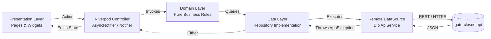

# Gate Closes Flutter (v2): System Features, Architecture & Data Contracts

> **Location:** `gate-closes-app-v2/docs/FLUTTER_V2_SYSTEM_ARCHITECTURE.md`  
> **Scope:** `gate-closes-app-v2` (Flutter Native Client) & its exact data integration with `gate-closes-api`  
> **Target Audience:** Lead Mobile Engineers, Full-Stack Architects, Product Leadership  

---

## 1. Executive Summary & Purpose

**`gate-closes-app-v2`** is the production-oriented Flutter rewrite of the Gate Closes native client (automated checks pass; physical-device validation of the map is pending). It replaces the legacy React Native/Expo application with a strictly enforced Clean Architecture system designed for deterministic state transitions, modularity, offline-first parsing, and reliable real-time networking.

The application serves travelers throughout the airport lifecycle across four core paradigms:
1. **Terminal Echo (Public Spatial Broadcast)**: Ephemeral voice memos (up to 10 seconds) anchored to synthetic airport circular boundaries.
2. **Parallel Soul (PS)**: Direct private channels between travelers sharing the exact same flight route ($A \rightarrow B$).
3. **Destination Thread (DT)**: Converging route private channels arriving at the same destination ($A \rightarrow C$ and $B \rightarrow C$).
4. **Baton Touch (BT)**: Cross-directional swap channels for gate advice and transit intel ($A \rightarrow B$ and $B \rightarrow A$).

---

## 2. Technical Stack & Dependencies

| Layer / Concern | Technology | Package / Version | Rationale & Responsibility |
| :--- | :--- | :--- | :--- |
| **Framework** | Flutter / Dart | Flutter SDK 3.x / Dart 3.x | Cross-platform native compilation (Android & iOS). |
| **State Management** | Riverpod 3 | `flutter_riverpod: ^3.3.2` | Compile-time safe dependency injection and state isolation. |
| **Routing & Navigation** | GoRouter | `go_router: ^17.3.0` | Declarative URL-like navigation with auth-guard redirects. |
| **Networking** | Dio + Retry | `dio: ^5.7.0`, `dio_smart_retry: ^7.0.1` | Interceptors for JWT auth, automatic token rotation, and retries. |
| **Error Modeling** | Functional Dart | `fpdart: ^1.2.0` | `Either<Failure, T>` functional return types (no raw UI `try/catch`). |
| **Secure Persistence** | OS Keychain | `flutter_secure_storage: ^10.3.1` | Encrypted JWT token and session storage. |
| **Geospatial & Maps** | Mapbox Maps | `mapbox_maps_flutter: ^2.31.0` | Vector rendering of 32-sided geodesic boundaries and echo pins. |
| **Audio Capture/Playback**| Record / AudioPlayers | `record: ^6.0.0`, `audioplayers: ^6.1.0` | 48kHz mono voice recording, amplitude stream, waveform playback. |
| **Realtime WebSockets** | Socket.IO Client | `socket_io_client: ^3.1.6` | WSS event streams for live echo feeds, message delivery, and reactions. |
| **Boarding Pass Capture** | Camera + ML Kit | `mobile_scanner`, `google_mlkit_text_recognition`, `image_picker` | On-device barcode scan and photo text recognition; nothing is uploaded. |
| **Ticket Parsing** | Pure Dart | BCBP + OCR text heuristics | Offline parsing into flight fields, with confidence scores. |
| **Location** | Geolocator | `geolocator: ^14.0.3` | Current position and live position stream (airport re-detection). |
| **Connectivity & Caching** | Connectivity / Files | `connectivity_plus: ^7.3.1`, `path_provider: ^2.1.5` | Offline banner; on-disk map data cache. |
| **Map Badges** | SVG | `flutter_svg: ^2.3.0` | Rasterizes the Expo pin badges into Mapbox icons. |
| **Idempotency Keys** | UUID | `uuid: ^4.5.1` | Keys that make create requests safe to retry. |

---

## 3. Clean Architecture & Code Organization

The application strictly groups code by **Feature Domain** rather than technical layer type.

```
gate-closes-app-v2/lib/
├── core/                           # Cross-cutting foundational infrastructure
│   ├── config/                     # Environment configuration (.env.dev / .env.prod)
│   ├── errors/                     # Sealed Failure and AppException hierarchies
│   ├── airports/                   # Offline IATA registry (bundled airports.json) + validator
│   ├── location/                   # Quantized GPS, position stream (~110m privacy)
│   ├── services/                   # Dio ApiService, StorageService, sockets, connectivity
│   └── utils/                      # Validators (Instagram username regex, password rules)
├── features/                       # Self-contained business domains
│   ├── airport/                    # Geolocation distance checks & airport boundary lookup
│   ├── auth/                       # 4-step registration wizard, login, password recovery, onboarding
│   ├── boarding_pass/              # Camera barcode scan, photo OCR pipeline, manual entry
│   ├── connections/                # Unified PS / DT / BT direct messaging & real-time chat
│   ├── flight/                     # Active flight ticket lifecycle management
│   ├── profile/                    # User profile hero, editor, password change, settings
│   ├── terminal_echo/              # Feed view, audio composer, thread views, emoji reactions
│   └── worldMap/                   # Home map: boundaries, clustered pins, heatmap, lighting
├── l10n/                           # Localized strings (en, es)
├── routes/                         # GoRouter route table (composition root) and redirect guards
├── shared/                         # Cross-feature widgets (map nav bar, airport gate dialog, pickers)
└── theme/                          # Ink-on-white minimalist design system & tokens
```

### The Unidirectional Request Lifecycle



1. **Presentation Layer**: Widgets and pages read controller state. Zero network calls or direct Dio instances allowed.
2. **Controller Layer**: Handles UI interaction, maps parameters, and updates reactive state.
3. **Domain Layer**: Pure Dart entities, repository interfaces and domain services. Use-case classes exist where they add logic (auth: login, refresh; profile: get profile); other controllers call repository interfaces directly, so the diagram's use-case step is optional in practice. No dependency on Flutter UI or networking libraries.
4. **Data Layer**: Models with manual `fromJson`/`toJson` serializers and repositories that translate network exceptions into strongly typed `Failure` classes (`ServerFailure`, `UnauthorizedFailure`, `NetworkFailure`).

---

## 4. End-to-End System Features

### 4.1 Multi-Stage Authentication & Onboarding
* **4-Step Registration Wizard**:
  1. `POST /api/auth/register-email` $\rightarrow$ Generates temporary user and sends 4-digit verification code.
  2. `POST /api/auth/verify-email` $\rightarrow$ Validates OTP code.
  3. `POST /api/auth/set-password` $\rightarrow$ Sets secure password (min 8 chars, 1 uppercase, 1 digit, 1 special).
  4. `POST /api/auth/set-username-gender` $\rightarrow$ Completes profile setup using Instagram-style usernames (`[a-zA-Z0-9._]{3,30}`).
* **Password Recovery Wizard**:
  * Step-by-step verification code dispatch, reset validation, and automatic authentication handoff.
* **Onboarding Wizard (`OnboardingPage`)**:
  * **Step 0 (Welcome Hero)**: Animated circular radar pulse hero, traveler identity intro.
  * **Step 1 (Profile Setup)**: Username input + gender pill selectors (`Male` / `Female`).
  * **Step 2 (Boarding Pass Ingestion)**: Scan / Manual toggle — live barcode camera, "Take photo" / "Upload screenshot" (OCR), or typed entry (§4.3). Marks onboarding seen for that user (stored per user id).

---

### 4.2 Terminal Echo (Spatial Voice Broadcasts)
* **Airport-Scoped Public Feeds**:
  * Automatically resolves nearest airport via `GET /api/airport/check-inside-airport?lat=X&lng=Y`.
  * Loads echo cards anchored to the active airport channel.
* **Audio Recording & Metering Composer**:
  * Up to 10 seconds of high-fidelity mono audio (AAC/M4A).
  * Live visual amplitude waveforms via real-time metering streams.
  * Direct audio binary upload via `FileUploadService` (`POST /api/s3/upload`), returning canonical S3/CloudFront URLs.
  * Voice memo is **mandatory**; caption text is optional.
* **Inline Waveform Playback**:
  * Audio players with dynamic playback progress indicators.
  * Fires listen count increments (`PATCH /api/terminal-echo/:id/listen`) when reaching the 70% duration threshold.
* **Thread Discussions & Reactions**:
  * Full thread view with audio/text replies.
  * 6-emoji reaction drawer (`like`, `love`, `haha`, `wow`, `sad`, `angry`).
  * Scoped WebSocket room listeners (`terminal_echo:changed` in `airport:<IATA>`; `terminal_echo_reply:created` in `thread:<echoId>`).

---

### 4.3 Boarding Pass Ingestion & OCR
* **Capture: Barcode → OCR → Manual** (`BoardingPassScannerSheet`):
  * Live camera barcode scan (PDF417 / Aztec / QR / DataMatrix).
  * "Take photo" / "Upload screenshot" for tickets without a usable barcode,
    run through `TicketExtractionPipeline`: barcode-in-image first, then ML
    Kit text recognition. Strategies are pluggable. Images are read on-device
    and deleted.
  * Every path ends in the same confirm/edit form.
* **Parsing**: IATA BCBP parser plus an OCR text parser (labels, then layout
  such as "MNL → CEB", then reading order; dates and times; month and ticket
  words that are also IATA codes are ignored).
* **Privacy (Core Invariant 5)**: passenger name, booking reference and raw
  payload are never extracted or kept.
* **Accuracy**: real-ticket fixtures in `test/fixtures/tickets/` (STEP 21);
  collection in progress.
* **Persistence**: `POST /api/flight-ticket` with an idempotency key; triggers
  backend affinity matching for PS, DT and BT.

---

### 4.4 Real-Time 1-on-1 Voice Messaging (Connections)
* **Unified Affinity Channels**:
  * Inbox tabs for **Parallel Soul**, **Destination Thread**, and **Baton Touch**.
  * Live socket updates via `ConversationSocketService` (`conversation:updated`) to refresh conversation cards and unread badges automatically.
* **Messenger-Style Voice Thread**:
  * Strictly voice-first (matches product mission).
  * Audio recorded via inline composer, uploaded to S3, and sent via `POST /api/conversations/:id/messages`.
  * Grouped chat bubble corner radiuses (`18.0` / `4.0`) based on consecutive message sequence from the same sender.
  * Long-press emoji reaction bar syncing reactions via `PATCH /api/conversations/:id/messages/:msgId/reaction`.

---

### 4.5 Map (home screen)
Behavior follows the Expo app's map shell; full mapping and status in
[MAP_EXPO_PARITY.md](MAP_EXPO_PARITY.md).

* **Engine**: `mapbox_maps_flutter` 2.31 (Mapbox Maps SDK v11), style
  `dark-v11`, globe projection.
* **Airport boundaries** (`GET /api/airport/geojson`): drawn as radar
  scopes in the app's lime accent `#BBE40A`: faint fill, glow and outline;
  from zoom 10 a grid (rings, spokes, edge ticks) on the 12 airports nearest
  the view center and a rotating sweep (4 s per turn, ~15 fps) on the
  nearest 6. No sweep on lite maps or in the background
  (`AirportRadar`; uncommitted as of 2026-10-01). Only polygons in the
  visible area are sent to Mapbox (none below zoom 7, at most 300). Sending
  the whole collection crashed Android with an out-of-memory error in the
  plugin's JSON conversion.
* **Echo pins** (`GET /api/terminal-echo/map`, fetched per visible area;
  bounds wrapped into -180..180 by `MapViewBounds`, `west > east` when the
  view crosses the antimeridian, at most the 100 newest per view):
  clustered symbol layer (radius 45, max zoom 15) with Expo's per-type
  badges, and an activity heatmap. Tap a cluster to zoom in; tap a pin for
  its card with START CONVERSATION (PS / DT / BT).
* **Location**: user puck; position stream re-detects the airport every
  250 m; last location (quantized, ~110 m) remembered 15 minutes.
* **Look**: Expo's theming over dark-v11 (terrain, dark water with a sheen,
  3D buildings from zoom 13); flat camera, rotation locked at zoom 3.5 and
  below; the tapped pin grows (0.85 vs 0.72) while its card is open.
* **Offline**: boundaries and pins cached on disk; offline / slow banner.
* **Map Lighting**: realtime or static time-of-day tint (Settings).

**Data contract.**
* Map features carry `id`, `type` (affinity), `createdAt`, `listenCount`
  and `reactionCount`; no sender id. The app derives freshness ("new" under
  20 minutes) and heatmap weight from them.
* Not available: `expiresAt` (echoes don't expire, so no pin is "fading")
  and reply counts (would cost an extra lookup per pin).

**Layering.**
```
API GeoJSON ─► EchoMapRepository ─► TerminalEchoMapNodeEntity (domain)
                                          │
WorldMapController (what to show) ◄───────┘
        │  airports, pins, visible boundaries, user location
        ▼
WorldMapPage (Mapbox rendering: sources, layers, camera, taps)
        ▲
EchoMapFeatures / AirportBoundaryIndex build the GeoJSON sent to Mapbox
```
The controller decides what is shown; only the page touches the Mapbox API.
GeoJSON is a rendering format, never a domain model: entities hold typed
fields, and GeoJSON is built only at the edge.

**Mapbox data-volume rule.** Sending a map source's data goes through the
plugin's JSON conversion on the Java heap, and a large payload runs Android
out of memory (it did). Therefore:
* Never send an unbounded collection to a Mapbox source. Filter to the
  visible area first.
* Airport boundaries: none below zoom 7, at most 300 per update.
* Pins: fetched per visible area. First load shows only cached pins; the
  API caps the unbounded (no-bounds) query at 200.
* Viewport-driven updates are debounced (300 ms after the camera stops).

**Current vs target rendering.** Today `WorldMapPage` owns sources, layers,
camera and taps. Target: a `WorldMapRenderer` (sources, layers, camera,
interactions) that the page drives. The extraction is deliberately deferred
until physical-device testing confirms current behavior.

---

## 5. Data Contracts & Backend Integration (`gate-closes-api`)

All network communication connects to `gate-closes-api` (Port `3001`).

### 5.1 Environment Configuration (`.env.dev`)
```env
ENVIRONMENT=dev
APP_NAME=Gate Closes (Dev)
BASE_URL=http://192.168.1.20:3001/api
# Or via adb reverse: BASE_URL=http://127.0.0.1:3001/api
ENABLE_LOGGING=true
MAPBOX_ACCESS_TOKEN=pk.eyJ1I...
```

---

### 5.2 Core API Endpoints & Payloads

#### 1. Authentication (`/api/auth`)
Verified against `user.auth.controller.ts`. Every response also carries a
human-readable `message`.
* `POST /auth/register-email` → **201**
  * Body: `{ "email": "traveler@example.com" }`
  * Response: `{ "userId": "...", "signupStep": "email_verification" }`
    (`"set_password"` if the email was already verified).
* `POST /auth/verify-email`
  * Body: `{ "userId": "...", "code": "1234" }`
  * Response: `{ "signupStep": "set_password" }`
* `POST /auth/set-password`
  * Body: `{ "userId": "...", "password": "Password123!", "confirmPassword": "Password123!" }`
  * Response: `{ "signupStep": "completed" }` (the account's signup is
    complete; username and gender follow).
* `POST /auth/set-username-gender`
  * Body: `{ "userId": "...", "username": "traveler_jane", "gender": "Female" }`
  * Response: `{ "user": { ... }, "signupStep": "completed", "signupCompleted": true }`
* `POST /auth/login`
  * Body: `{ "email": "...", "password": "..." }`
  * Native: `{ "user": { ... }, "accessToken": "...", "refreshToken": "...", "requiresProfileCompletion": bool }`
  * Web (`?client=web` or `x-client-type: web`): same without tokens; they are
    set as HttpOnly `session_token` / `refresh_token` cookies.
* `POST /auth/refresh`, `POST /auth/logout`, `GET /auth/me`,
  `POST /auth/change-password`
* `PATCH /auth/edit-profile` (Bearer Token Required)
  * Body: `{ "username": "traveler_jane", "gender": "Female" }`

#### 2. Airport Geospatial Pipeline (`/api/airport`)
* `GET /airport/check-inside-airport?lat=1.3644&lng=103.9915`
  * Response: `{ "insideRadius": true, "iata": "SIN", "airport": "Singapore Changi Airport", "distanceKm": 1.2 }`
* `GET /airport/geojson`
  * Response: GeoJSON FeatureCollection of 32-sided geodesic boundary circles.

#### 3. Flight Tickets (`/api/flight-ticket`)
* `POST /flight-ticket` (header `Idempotency-Key`; also accepted in the body)
  * Body:
    ```json
    {
      "flightNumber": "SQ321",
      "fromAirport": "SIN",
      "toAirport": "SYD",
      "departureDateTime": "2026-10-15T08:30:00.000Z",
      "boardingDateTime": "2026-10-15T07:50:00.000Z",
      "terminal": "3", "gate": "B4", "seat": "42K",
      "idempotencyKey": "…"
    }
    ```
  * `PUT /flight-ticket` updates the same fields; `DELETE` removes it.

#### 4. Terminal Echo (`/api/terminal-echo`)
* `POST /terminal-echo` (header `Idempotency-Key`)
  * Body (coordinates quantized to 3 decimals, about 110 m):
    ```json
    {
      "fileUrl": "https://…/voice.m4a",
      "fileName": "voice.m4a",
      "textMessage": "Gate delayed 45 minutes",
      "airportName": "Singapore Changi Airport",
      "location": { "type": "Point", "coordinates": [103.992, 1.364] },
      "audioDuration": 8200,
      "waveformData": [0.1, 0.4, …]
    }
    ```
* `PATCH /terminal-echo/:id/listen` counts a listen (fired at 70% playback).
* `PATCH /terminal-echo/:id/reaction` → `{ "reaction": "like" }` (toggle).
* `GET /terminal-echo?airportIata=SIN` $\rightarrow$ Array of echo objects with reaction tallies.
* `GET /terminal-echo/map?west=&south=&east=&north=` $\rightarrow$ GeoJSON
  FeatureCollection; each feature has `id` and `properties`
  `{ type, createdAt, listenCount, reactionCount }`. Without bounds, at
  most 200 features.

#### 5. Unified Conversations (`/api/conversations`)
* `GET /conversations` $\rightarrow$ the user's conversations with `hasUnread`
  and the latest event text.
* `POST /conversations` (header `Idempotency-Key`) →
  `{ "type": "parallel_soul", "otherUserId": "…" }`; 409 if it exists.
* `GET /conversations/existence?type=&otherUserId=` →
  `{ "exists": bool, "conversationId": "…" | null }`
* `POST /conversations/:id/messages` →
  `{ "fileUrl", "fileName", "textMessage", "audioDuration", "waveformData" }`
* `PATCH /conversations/:id/messages/:msgId/reaction` →
  `{ "reaction": "like" }` (one of like, love, haha, wow, sad, angry).

---

### 5.3 API Contract Status

| Contract | Status |
| :--- | :--- |
| Auth (login, 4-step signup, reset, refresh, logout, edit profile) | Implemented |
| Airport detection, nearby, search, GeoJSON | Implemented |
| Flight ticket (with boarding-pass fields, idempotent create) | Implemented |
| Terminal Echo (create, feed, replies, reactions, listens) | Implemented |
| Echo map pins (`id`, `type`, `createdAt`, listen / reaction counts) | Implemented (API `6f2fa82`, pushed) |
| Echo map pins for wide / antimeridian views (`west > east` accepted) | Implemented (API, uncommitted as of 2026-10-01) |
| Conversations (create, messages, reactions, read) | Implemented |
| Realtime `conversation:updated` to participants | Implemented (API `main`, needs deploy) |
| Map pin `expiresAt` | Not applicable: echoes don't expire |
| Map pin reply counts | Not planned (extra lookup per pin) |
| `existence` check returning the conversation id | Implemented (API, needs deploy); the app still finds the id in its list |

---

## 6. Runtime Contracts

### 6.1 Authentication Lifecycle
1. Login returns access + refresh tokens, stored **only** in
   `flutter_secure_storage` (never in the SharedPreferences user cache).
2. `AuthInterceptor` attaches the bearer token to every request except
   login/refresh.
3. A 401 triggers one refresh, then the request is replayed. Concurrent 401s
   are queued; a request whose token was already rotated replays with the new
   token instead of refreshing again.
4. A failed refresh clears the local session; the router returns to login.
   A 403 is a permission error, not a sign-out.
5. Cold start keeps the cached user when offline; only a rejected session
   signs out.
6. Logout always clears the local session; the server revoke is best-effort.
7. User-scoped state (connections, feed, flight, profile, sockets) resets when
   the signed-in user changes.

### 6.2 Socket.IO Lifecycle (`AuthenticatedSocket`)
* The access token is read on every (re)connect handshake.
* Transport drops reconnect automatically. A server-rejected handshake
  revalidates the session, then reconnects with backoff (max 30 s).
* Rooms are joined on every connect, so they are rejoined after recovery,
  and left on dispose (`leave_conversation`, `terminal_echo:leave_airport`,
  `terminal_echo:leave_map`).
* Each open screen owns one socket; opening another replaces it, so listeners
  are never duplicated.
* Sockets close when the signed-in user changes.

### 6.3 Offline Behavior

| Feature | Offline |
| :--- | :--- |
| App start | Opens with the cached user |
| Map boundaries and pins | Last cached data, with an offline banner |
| Map centering | Last location if under 15 minutes old |
| Boarding-pass scan / photo OCR / parsing | Works fully on-device |
| Saving a flight ticket | Fails with an error; no queue yet |
| Airport detection | Needs the network (the offline registry is for ticket parsing only) |
| Feed, threads, conversations | Not cached; show an error / retry |
| Posting echoes, messages, reactions | Needs the network; retries are safe (idempotency keys) |
| Logout | Clears the device session |

### 6.4 Privacy & Security Invariants
* Passenger name, booking reference (PNR) and raw barcode/OCR text are never
  extracted, shown or stored (Core Invariant 5). Ticket images are read
  on-device and deleted.
* Location sent to the API is quantized to 3 decimals (~110 m). The last
  known location is kept **on the device only**, at the same ~110 m
  precision, for 15 minutes, to center the map.
* Map pins carry no sender id.
* Tokens live in platform secure storage.
* Production uses HTTPS (`https://api.gatecloses.com/api`); request/response
  logging is on only when `ENABLE_LOGGING=true` (dev).
* Real-ticket test fixtures are redacted and reviewed before commit; ticket
  images are never committed.

### 6.5 Performance Budgets
No measured numbers yet; to be set after device testing. Constraints already
enforced: bounded Mapbox payloads (§4.5), debounced viewport updates, pin and
boundary sources updated in place rather than recreated.

---

## 7. Testing & Quality Gates

The Flutter codebase enforces strict verification routines before any merge:

1. **Linting & Code Formatting**:
   ```bash
   dart format --set-exit-if-changed .
   flutter analyze
   ```
   *(Must exit with 0 issues).*
2. **Automated Unit & Widget Test Suite**:
   ```bash
   flutter test
   ```
   * **137 automated tests currently passing** (the full `flutter test` suite), covering:
     * Model JSON serialization/deserialization contracts.
     * Repository error mapping (`AppException` $\rightarrow$ `Failure`).
     * Controller Riverpod state transitions.
     * Onboarding wizard page navigation and form submission.
     * Boarding pass parsing, extraction pipeline and fixture harness.
     * Map pins, boundary filtering, lighting and offline caches.
     * Quantized geographic coordinates privacy formatting.
3. **Android Gradle Engine**:
   * Android Gradle Plugin 9.0.1, Gradle 9.1, Kotlin 2.3.20; debug APK builds with the Mapbox Maps v11 SDK.
4. **Architecture Guards (CI)**:
   * Feature isolation: features may import only the shared features `auth`, `airport` and `flight`.

---

## 8. Current Implementation Status

**Built and passing automated checks:** auth and onboarding, boarding-pass
barcode / OCR / manual capture with privacy filtering, Terminal Echo,
Connections (PS / DT / BT, starting conversations from map pins), the
Expo-parity map shell, location tracking, offline map caching, Map Lighting.
166 tests pass, `flutter analyze` is clean, the Android debug build succeeds
(2026-10-02, including the uncommitted map work).

**Pending:**
* Physical Android device validation: the map runs on a realme RMX3231 and a
  Xiaomi 2201116SG (`HANDOFF.md` §1); the radar look and zoomed-out clusters
  are not yet seen on a device.
* iOS build and device validation (needs a Mac).
* Production-scale map data testing.
* Confirm production runs the pushed API changes (`conversation:updated`,
  map metadata, existence check id): pushing API `main` deploys.
* 20+ real boarding-pass fixtures for parser accuracy.
* GitHub Actions: blocked by an account billing lock.

**Readiness:** production-oriented, with automated verification complete.
Physical-device and production-scale runtime validation remain outstanding.
